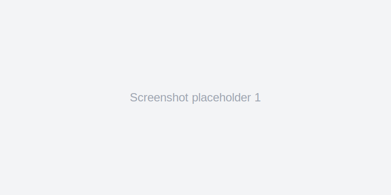
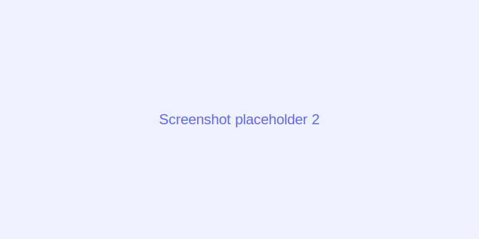

## 🛠️ Desarrollo (para contribuyentes)

Si quieres trabajar en la extensión localmente, sigue estos pasos:

1. Instala dependencias:

```bash
npm ci
```

2. Compila el proyecto (TypeScript → `out`/`dist`):

```bash
npm run compile
```

3. Desarrollo rápido — reconstrucción con esbuild en modo watch:

```bash
npm run watch:esbuild
```

4. Ejecuta el conjunto de tests unitarios:

```bash
npm test
```

<!--
English README (primary). This file provides a concise overview, TOC and development instructions.
-->

# Master SVG

<p align="center">
	
</p>

<p align="center">
	<strong>Professional SVG icon management studio for VS Code</strong><br>
	Preview, edit, transform and build icon components for your design system.
</p>

<p align="center">
	<a href="https://marketplace.visualstudio.com/items?itemName=MasterSVG.mastersvg-icon-studio"></a>
	
	
	
	
</p>

---

## Contents

- [Master SVG](#master-svg)
  - [Contents](#contents)
  - [Key Features](#key-features)
  - [SVG File Browser](#svg-file-browser)
  - [Visual Editor](#visual-editor)
  - [Icon System Builder](#icon-system-builder)
  - [IntelliSense \& Actions](#intellisense--actions)
  - [Component Export](#component-export)
  - [Iconify Integration](#iconify-integration)
  - [Commands](#commands)
  - [Configuration](#configuration)
  - [`.msignore` file](#msignore-file)
  - [Web Component](#web-component)
  - [Internationalization](#internationalization)
  - [Development](#development)
  - [CHANGELOG](#changelog)
  - [Screenshots](#screenshots)
  - [Contributing](#contributing)
  - [Support / Issues](#support--issues)
  - [License \& Credits](#license--credits)

---

## Key Features

| Feature | Description |
|--------:|-------------|
| 📁 **SVG Browser** | Browse, search and organize all SVG files in your workspace |
| 🎨 **Visual Editor** | Edit colors, apply variants, add animations with live preview |
| ⚡ **Icon Builder** | Generate `icons.js`, `sprite.svg` and Web Components |
| 🔍 **IntelliSense** | Autocomplete, hover previews for icons |
| 📦 **Component Export** | Export to React, Vue, Svelte, Angular, Solid, Qwik, Preact |
| 🌐 **Iconify** | Access 200k+ open source icons |

---

## SVG File Browser

Dedicated sidebar panel with multiple views: Files, Code (inline), Built Icons and Preview. Supports automatic workspace scanning, configurable SVG folders and `.msignore`.

---

## Visual Editor

Color extraction and replacement, variants (light/dark), animation presets (31 built-in), and live preview.

---

## Icon System Builder

Generates a complete icon system:

```
mastersvg-icons/
├── icons.js
├── icons.d.ts
├── sprite.svg
├── icon.js
└── variants.js
```

---

## IntelliSense & Actions

- Autocomplete for icon names, variants and animations
- Hover previews and metadata
- Code actions to convert inline SVGs or `` tags to components

---

## Component Export

Export production-ready components for multiple frameworks with TypeScript support and customizable options.

---

## Iconify Integration

Search and import icons from Iconify collections (200k+ icons). Automatic license attribution generation available.

---

## Commands

- `masterSVG.openPanel` — Open main panel
- `masterSVG.buildIcons` — Build icons collection
- `masterSVG.insertIcon` — Insert icon to editor
- `masterSVG.exportComponent` — Export icon as component

See `package.json` for the full command list.

---

## Configuration

Settings are under `masterSVG.*` (output format, svg folders, svgo options, preview settings, etc.).

---

## `.msignore` file

Create `.msignore` in the workspace root to exclude files/folders from scanning; the extension provides syntax highlighting and support for it.

---

## Web Component

Generated `icon.js` web component (`<svg-icon name="...">`) supports `size`, `color`, `variant`, `animation`, `light-color` and `dark-color` attributes.

---

## Internationalization

Supports `en`, `es`, `zh`, `ru`. Controlled by `masterSVG.language` or auto-detect.

---

## Development

Local development quick start:

```bash
# Install deps
npm ci

# Compile
npm run compile

# Fast rebuild (esbuild watch)
npm run watch:esbuild

# Run tests
npm test

# Lint and format
npm run lint
npm run format

# Package extension
npm run package
```

Use the VS Code debug configuration "Run Extension" (F5) and `npm run watch:esbuild` to iterate quickly.

---

## CHANGELOG

See [CHANGELOG.md](CHANGELOG.md) for release notes.

---

## Screenshots

Capturas de ejemplo (reemplaza con imágenes reales en `resources/screenshots/`):




---

## Contributing

Please open an issue before larger changes. Fork → feature branch → PR with description, small commits, and tests. Run `npm test` and `npm run format` before submitting.

---

## Support / Issues

Open issues at: https://github.com/Adravilag/MasterSVG/issues

Include extension version, VS Code version, reproduction steps and sample SVGs when reporting bugs.

---

## License & Credits

MIT — see `LICENSE`.

Author: Adrián Dávila Guerra — https://adravilag.github.io/MasterSVG/
